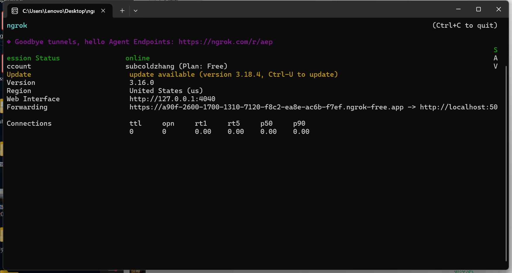

# Intelligent Voice Assistant with OpenAI and Twilio

## **Overview**

This project implements an **Intelligent Voice Assistant** that interacts with users via phone calls using **Twilio** and **OpenAI's GPT-3.5-turbo model**. The goal is to use AI to improve the accessibility and convenience of mobile phone interactions, particularly for individuals who may find modern smartphones challenging to use.

The assistant is designed to provide a natural, conversational phone interface, enabling tasks such as **ordering food, making reservations, and getting general assistance**. It is especially beneficial for **elderly individuals**, simplifying their access to essential services through voice commands.

Additionally, this system can **save time and reduce manpower for companies** by automating repetitive tasks and handling customer queries. By combining **Twilio's telephony APIs** with **OpenAI's advanced NLP capabilities**, the project delivers a seamless, efficient, and accessible voice-based solution, improving both user experience and operational efficiency.

### **Problem Addressed**
Traditional automated phone systems are often rigid, limited in functionality, and unable to handle complex or conversational user queries. This project addresses the need for a more flexible, AI-driven solution by tackling the following challenges:

1. **Elderly Accessibility**:
   - Many elderly users find modern smartphone interfaces overwhelming and difficult to navigate. This project simplifies their experience by enabling natural speech interactions, making it easier to accomplish everyday tasks like placing food orders, booking reservations, or getting assistance.

2. **Business Efficiency**:
   - Companies frequently allocate significant resources to handle repetitive tasks and customer inquiries. By automating these processes, this project reduces the dependency on human agents, cutting operational costs while ensuring consistent customer satisfaction.

3. **Advanced Telephony Integration**:
   - This project demonstrates how AI-powered telephony solutions can effectively solve real-world problems by integrating natural language processing with voice-based interfaces, enhancing both accessibility for users and efficiency for businesses.

### **Approach**
1. **Speech Input**: Utilizes Twilio's telephony APIs to capture user speech directly from phone calls, enabling seamless voice-based interaction.

2. **Natural Language Understanding**: Processes the captured speech using OpenAI's GPT-3.5-turbo to understand the user's intent and generate contextually appropriate and intelligent responses.

3. **Real-Time Voice Interaction**: Converts the AI-generated responses back into speech and delivers them to the user via Twilio's Voice API, maintaining a natural conversational flow.

4. **Logging and Monitoring**: Implements a robust logging system to track user interactions, AI responses, and system performance, facilitating debugging and continuous improvement.

## **How the Problem Was Addressed**
To address the identified challenges, the project combines advanced technologies with thoughtful design choices:

- **Integration of Flask Framework**: Utilized **Flask** as the backend framework to efficiently manage API requests and responses. This provided a robust and scalable foundation for handling user interactions and processing logic.

- **Leveraging Twilio's Telephony Services**: Employed **Twilio's VoiceResponse** API to handle voice calls, including speech-to-text and text-to-speech conversions. This enabled seamless voice interactions, allowing users to communicate naturally over the phone.

- **Incorporation of OpenAI's GPT-3.5-turbo Model**: Integrated **OpenAI's GPT-3.5-turbo** for advanced natural language understanding and response generation. The model processes user inputs to comprehend intent and provides contextually appropriate and intelligent replies.

- **Implementation of a Robust Logging System**: Established comprehensive logging to monitor all interactions, capture errors, and provide real-time feedback on user queries and system responses. This facilitates debugging, performance monitoring, and continuous improvement.

The system supports dynamic multi-turn conversations, enabling users to perform various tasks through simple voice commands. Users can easily terminate the call at any time by saying "end," giving them full control over the interaction. This approach ensures a natural and intuitive user experience, particularly benefiting elderly individuals and streamlining business operations.

## **Impact**
### **What Does This Project Achieve?**
- **Enhanced Accessibility**: Provides elderly users with an easy-to-use, voice-controlled system that simplifies access to essential services, eliminating the need to navigate complex smartphone interfaces.
- **Improved Efficiency for Businesses**: Reduces the need for human intervention in repetitive tasks, saving time and operational costs while maintaining a high standard of customer interaction.
- **Versatile Use Cases**: Supports diverse applications such as food ordering, appointment scheduling, customer support, and information retrieval, making it adaptable to various industries.
- **Technological Advancement**: Showcases the successful integration of telephony APIs and advanced NLP models to create smart, conversational voice assistants capable of real-world applications.

### **Revelations**
- **Dynamic Conversations**: The project demonstrates that voice-based AI systems can effectively manage multi-turn, dynamic interactions, providing users with a natural and seamless experience.
- **Scalability**: Combining Twilio and OpenAI highlights the potential for scalable solutions in domains such as customer service, elderly care, and task automation.
- **Areas for Improvement**: Handling noisy or ambiguous input remains a challenge, suggesting opportunities for refining speech recognition accuracy and enhancing context awareness in NLP models.

## **Next Steps**
### **Enhancements**
1. **Multi-Language Support**: Expand the assistant's capabilities to include support for multiple languages, ensuring accessibility for a diverse range of users across different regions.
2. **Enhanced Context Awareness**: Implement advanced memory features to retain information from previous conversations, allowing for more context-aware and coherent multi-turn interactions.
3. **Customized Voice Options**: Introduce dynamic voice synthesis to align with user preferences or specific brand identities, improving personalization and user satisfaction.
4. **Advanced Task Automation**: Integrate external APIs to handle specific tasks such as restaurant reservations, weather updates, or calendar management, further expanding the assistant's utility.

### **Deployment**
- Deploy the application on a reliable cloud platform (e.g., AWS, Azure, or Google Cloud) to ensure scalability, availability, and public access.
- Establish robust security protocols to safeguard sensitive user data and API keys, including encryption and secure authentication mechanisms.

### **Evaluation**
- Gather user feedback to assess usability, interaction quality, and satisfaction levels, enabling continuous refinement of the system.
- Analyze system logs to detect and address common errors, monitor performance, and identify areas for further optimization.
- Conduct stress testing to evaluate the system's scalability and reliability under high usage scenarios.

## **How to Run the Project**
### **Prerequisites**
1. Install Python (3.8 or later).
2. Install required Python packages:
   ```bash
   pip install flask twilio openai
   ```
3. Download and install ngrok from ngrok.com.
4. Set up Twilio and OpenAI API keys.

### **Steps**
1. Run the Flask Application:
   ```bash
   python app.py
   ```


2. Start ngrok:
   ```bash
   ngrok http 5000
   ```
   Copy the public URL generated by ngrok.


3. Configure Twilio:
- Go to the Twilio console.
- Set the webhook URL to the ngrok public URL (e.g., https://your-ngrok-url.ngrok.io/voice).


4. Make a Call:
- Dial the Twilio phone number to interact with the assistant.

### **Monitoring**
- Logs are displayed in real-time in the terminal.
- Use ngrok's web interface (http://127.0.0.1:4040) to monitor HTTP requests and responses.

## **Technologies Used**
- Flask: Lightweight web framework for handling API requests.
- Twilio: Telephony API for call routing and speech-to-text conversion.
- OpenAI GPT-3.5: For natural language understanding and response generation.
- ngrok: For exposing the local server to the internet.
- Python: Core programming language.
- Logging: For real-time interaction monitoring and debugging.

## **Reference**
- https://www.twilio.com/docs/voice/tutorials/how-to-respond-to-incoming-phone-calls/python
